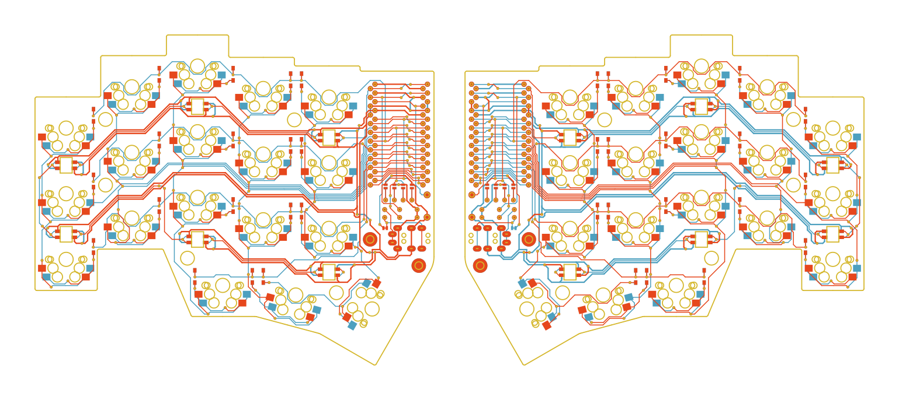

# Fifi

# board information
**The Fifi keyboard, named after my , is a split keyboard with 3x5 column staggered keys and 3 thumb keys, based on foostan's mini-[crkbd](https://github.com/foostan/crkbd/) schematic and thomasbaart's [kyria](https://github.com/splitkb/kyria) layout.**

- creator: raychengy
- source: [Github](https://github.com/raychengy/fifi_split_keeb)
- type: split

