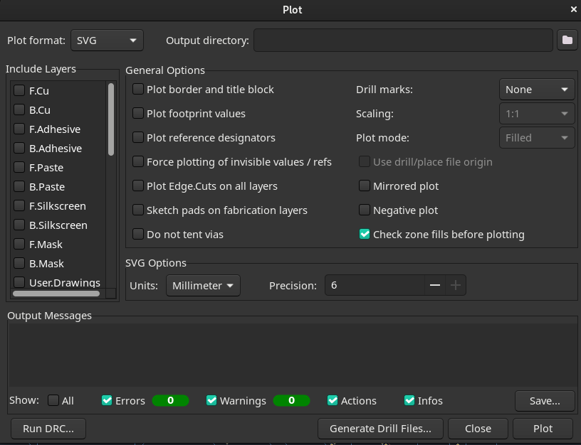
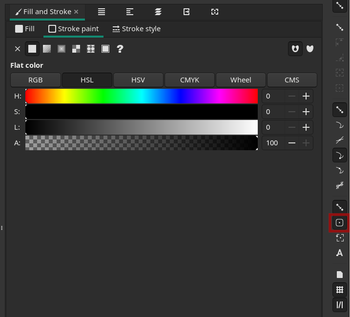
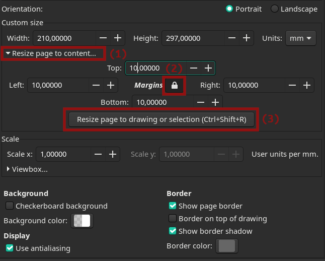
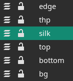
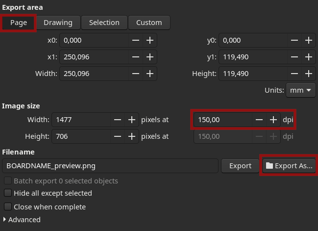

# Howto

**this looks way more complicated than it is**

This discribes the process I use to create the svg images. I will use [Kicad](https://www.kicad.org/) for exporting the board data and [Inkscape](https://inkscape.org) to compose the images.

If you happen to create/convert a board, consider creating a pull request for it, I would be very happy to add it to this repository (credit will go to you of course).

## converting the pcb data
- open the psb project in Kicad.
- if there are GND fills, remove them ( I think this ensures a cleaner look, but you may also keep them in, if you like it)
- add a circle on F.Cu layer. This will be used to align the layers in inkscape, so size and placement don't matter much. Just make sure you are able to easily locate it. I put it outside the board edge, but relatively close. 
- open the plot dialog ( File->Plot... )
- Change "Plot format:" to SVG and select a proper "Output directory:"
- right click on any layer in "Include Layers" and "deselect all layers". Remove all checkmarks in "General Options" (You may want to keep "Check zone fills before plotting", so you get dialog if you forgot to delete a fill)

  
    
 - select F.Cu layer. set "Drill marks:" to "Actual Size". Plot
 - go to the svg folder and rename the file (add _th or something like that)
 - back to plot dialog: set "Drill marks:" to "None". Plot
 - now seperately plot layers B.Cu, Edge.Cut and, if something interesting is there, F.Silkscreen and B.Silkscreen. Each time change the layer of the alignment circle to the appropriate layer (double click and change).
 
 ## creating svg
 - open a new inkscape document
 - edge layer
     - open Layer view (Shift+Ctrl+L) and rename layer to "edge"
     - import edge.cuts plot. 
     - Open Fill+Stroke dialog (Shift+Ctrl+F). 
         - in Stroke Style tab set Width to 0.3mm
         - in Stroke Paint tab, select Flat Color and set color to #d5b72bff
 - through hole pads layer
     - open layer view. Add new layer "thp"
     - import renamed F.Cu plot.
     - double click on the imported plot until one line is selected. right click->Select Same->Stroke Color. Deselect alignment Circle (hold shift and left click on circle). Delete everything selected.
     - select whole plot group.
     - Open Fill+Stroke dialog
         - in Stroke Style tab set Width to 0.3mm
         - in Stroke Paint tab, select Flat Color and set color to #d5b72bff
         - in Fill tab, select the X (do this even though there is no fill visable, else the holes will be filled white)
     - activate "Toggle Snapping to Object Midpoint"
     - align the layer to the previous layer by snapping the alignment circles
         
        
         
 - Top layer
     - open layer view. Add new layer "top"
     - import F.Cu plot.
     - Open Fill+Stroke dialog
         - in Stroke Paint tab, select Flat Color and set color to #e6471cff
         - in Fill tab, select Flat Color and set color to #e6471cff
     -  align the layer to the previous layer by snapping to the alignment circles
     
 - Bottom layer
     - open layer view. Add new layer "bottom"
     - import F.Cu plot.
     - Open Fill+Stroke dialog
         - in Stroke Paint tab, select Flat Color and set color to #4da0bfff
         - in Fill tab, select Flat Color and set color to #4da0bfff
     -  align the layer to the previous layer by snapping to the alignment circles

- [optional] silk layers
    - open layer view. Add new layer
    - import silkscreen plot
    - Open Fill+Stroke dialog
        - in Stroke Paint tab, select Flat Color and set color to #107c9260 or #a832125f
        - in Fill tab, select Flat Color and set color to #107c9260 or #a832125f
     -  align the layer to the previous layer by snapping to the alignment circles

- background
    - open layer view. Add new layer "bg"
    - select group on edge layer
    - open Document Propertes dialog (Ctrl+Shift+D) and expand "Resize page to content" (1).
    - lock margins (2) and enter 10 for top. "Resize page to drawing or selection" (3).
      
- select "bg" layer. Add rectangle and resize it to match Width and Height in document dialog.
- Open Fill+Stroke dialog
        - in Stroke Paint tab, select Flat Color and set color to #232932ff
        - in Fill tab, select Flat Color and set color to #232932ff
- lock the "bg" layer

## cleanup
- sort the layers to this order (if you have a silk layer, I like it to be on top of top and bottom):

  
  
- clean up the layers if there are things that look strange (like double pads, pads going over edge, etc.)
- remove pads from srewholes if they look too out of place. Every hole will have at minimum one large pad on top and bottom layer for each hole. I think they often look too dominant, because they are quite large in comparison to other pads. But if you like the look let them in.

## saving and preview [optional]
- lock and hide "bg" layer. Unlock and show all other layers.
- save as inkscape svg as "BOARDNAME_orig.svg" to directory named like the board
- Open "Export PNG Dialog" (Ctrl+Shift+E). 
    - Set "Export Area" to "Page"
    - Set "Image Size" to 150 dpi
    - Click "Export to" and save as "BOARDNAME_preview.png" to the same directory as the svg.
      
`
## create a merge request, so I can add the board :D [optional]
- add/copy over README.md and fill in the board information

         
