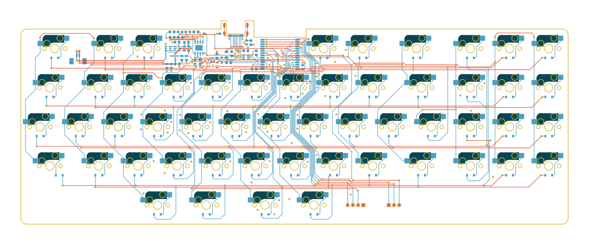
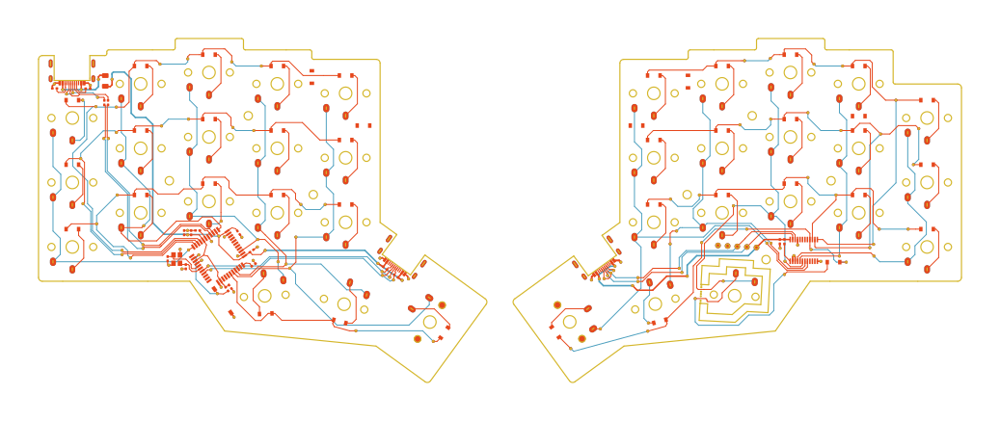

This repository contains vector graphics of the pcb data from open source keyboards.

I started this mainly because I wanted to make a deskmat of my keyboard design and needed high res images of the pcb.
Didn't stopped there and did some more for different people and really enjoyed seeing how different and interesting each keyboards pcb looked when pulled to the light.

# files
each keyboard has it's own directory with the following files: 
- #KEYBOARD_NAME_orig.svg: vector graphic scaled to the original size of the pcb.Each pcb layer has it's own layer in the svg, so you can easily change colors of each layer to your needs.
- #KEYBOARD_NAME_preview.png: scaled down export from the svg. Used in the documents to visualize the keyboards
- README.md: contains the preview picture and information on each board with links to the creator and the kicad sources for each board

# Gallery
## unibody
- [Klacker BS](./Klacker_BS) 

## split
- [3w6](./3W6) 

