This repository contains vector graphics of pcb data from open source keyboards.

I started this mainly because I wanted to make a deskmat of my keyboard design and needed high res images of the pcb.
Didn't stopped there and did some more for different people and really enjoyed seeing how different and interesting each keyboards pcb looked when pulled to the light.

**please note**
The majority of these are NOT my own designs. I've added information to each board and where to find the original sources in each keyboards folder. If you like what you see, please head over to the creator and give him/her a star for their creation. 

# files
each keyboard has it's own directory with the following files: 
- #KEYBOARD_NAME_orig.svg: vector graphic scaled to the original size of the pcb.Each pcb layer has it's own layer in the svg, so you can easily change colors of each layer to your needs.
- #KEYBOARD_NAME_preview.png: scaled down export from the svg. Used in the documents to visualize the keyboards
- README.md: contains the preview picture and information on each board with links to the creator and the kicad sources for each board

# create one for yourself
Take a look at the [Howto](./HowTo/README.md).

I would be more than happy to add more boards to this repo, so if you would like to share your creation, please create an issue or even better create a merge request. Thanks a lot!

# Galleries
[unibody previews](./Unibody)

[split previews](./Split)

## unibody
- [Absolem](./Absolem)  
- [Adalyn](./Adalyn) 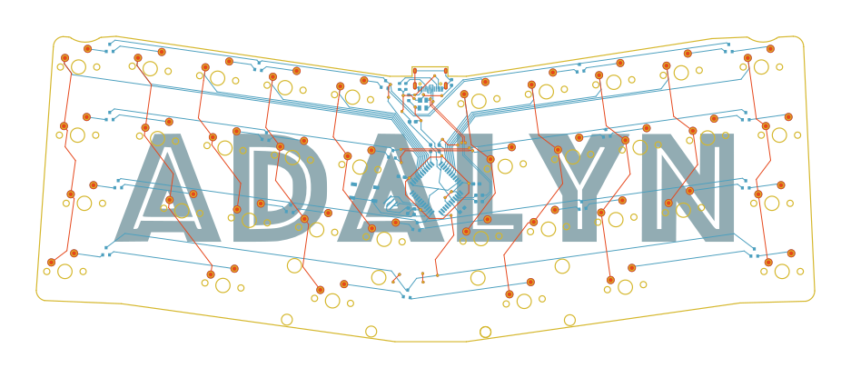
- [Balbuzard](./Balbuzard) 
- [Barobord](./Barobord) 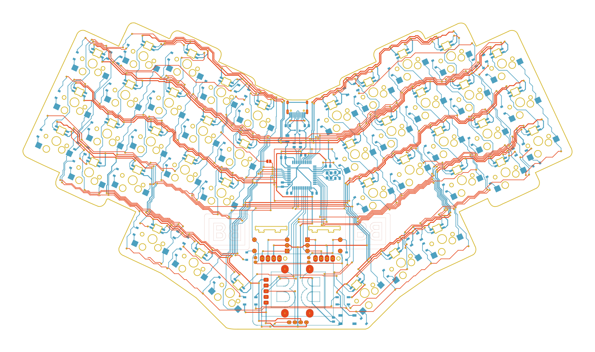
- [Endeavour](./Endeavour) 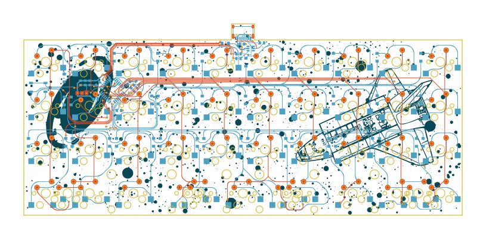
- [FK45](./FK45) 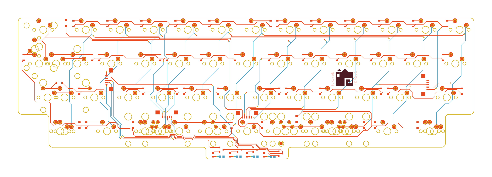
- [Klacker BS](./Klacker_BS) 
- [Le Chiffre BLE](./Le_Chiffre_BLE) 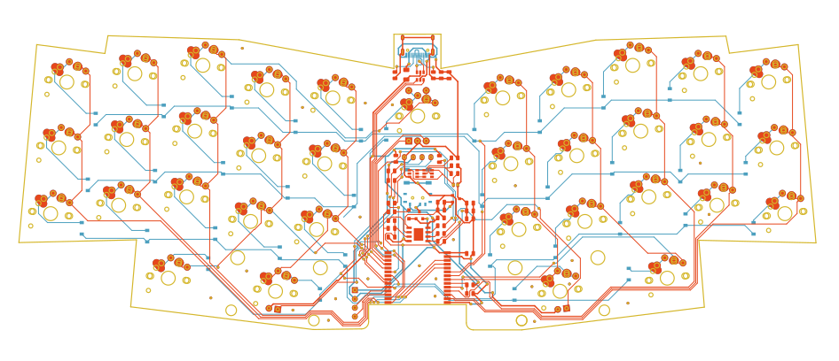
- [Lumberjack](./Lumberjack) 
- [Osprette](./Osprette) 
- [QEZ](./QEZ) 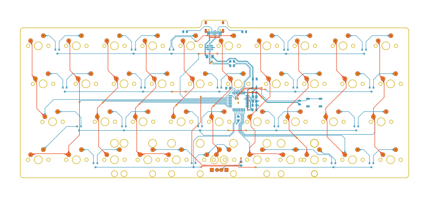
- [Reviung41](./Reviung41) 
- [Tipper TF](./Tipper_TF) 
- [Unibody Sweep](./Unibody_Sweep) 
- [Vertex](./Vertex) 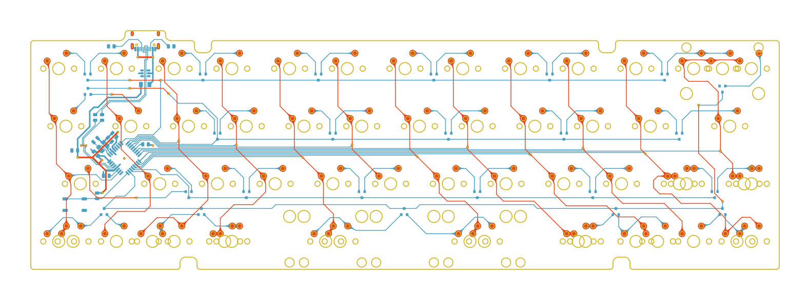
- [XVIII The Moon](./XVIII_The_Moon) 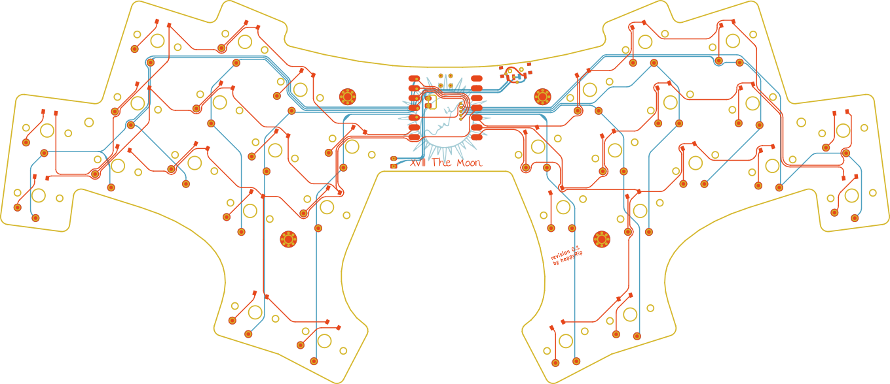

## split
- [3w6](./3W6) 
- [Anna](./Anna) 
- [Architeuthis Dux](./Architeuthis_Dux) 
- [Artemis](./Artemis) 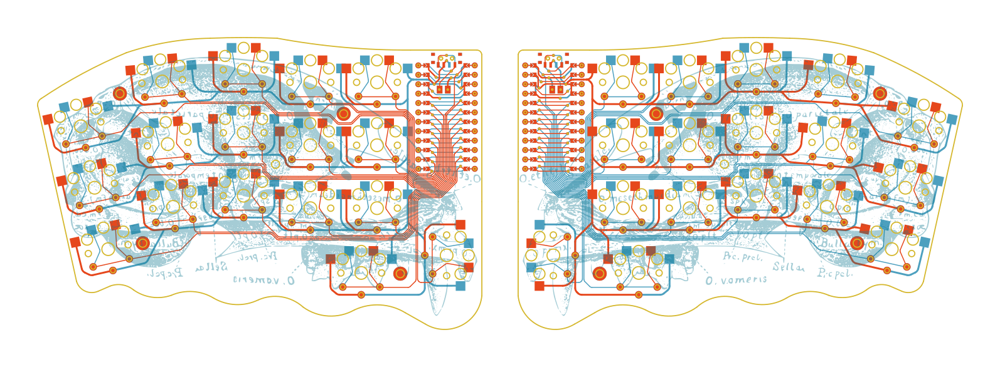
- [Clog](./Clog) 
- [Corne](./Corne) 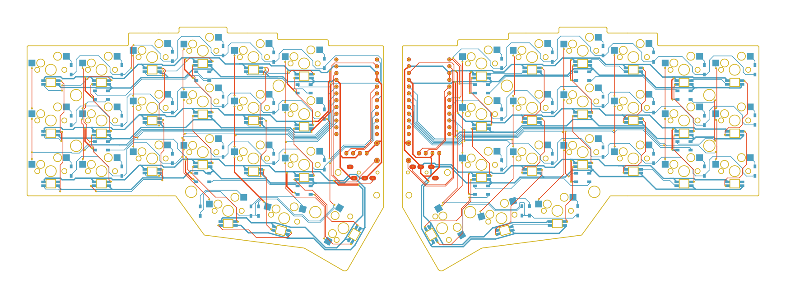
- [DracuLad](./DracuLad) 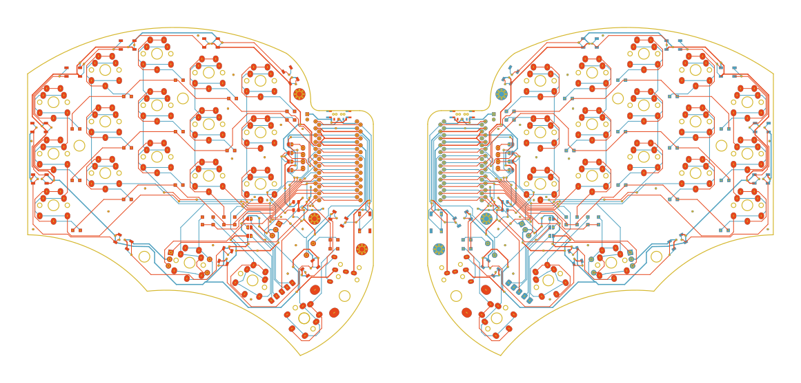
- [Ferris](./Ferris) 
- [Fifi](./Fifi) 
- [Hillside](./Hillside) 
- [Lily58](./Lily58) 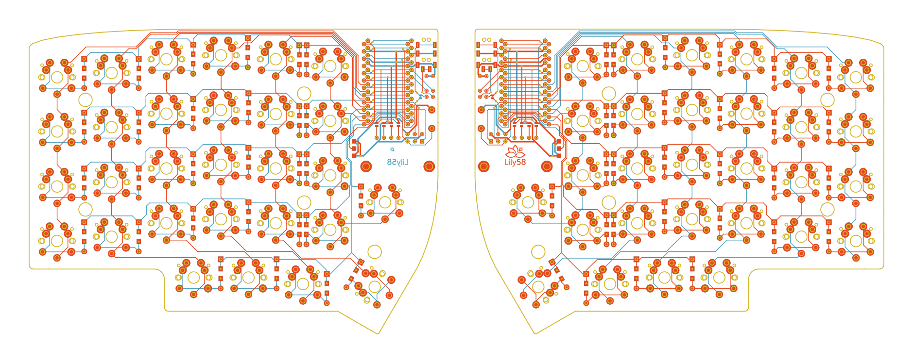
- [Reviung34 Split MK II](./Reviung34_MK_II) 

